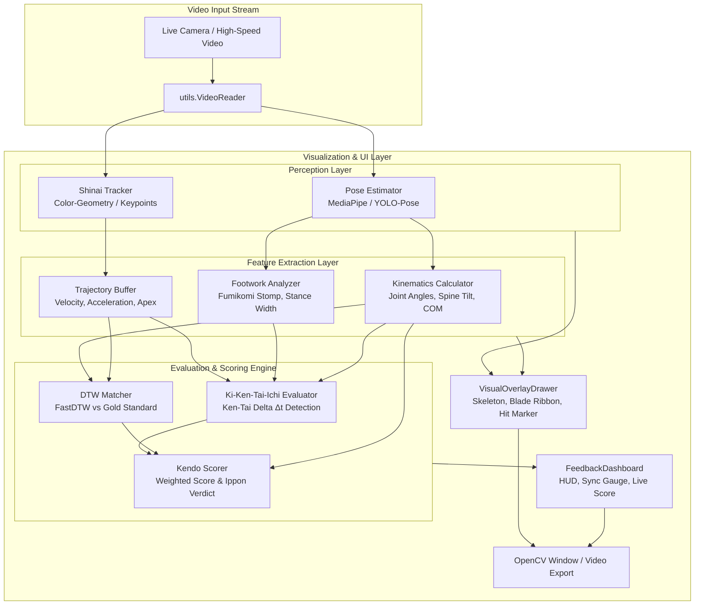

# Open-Kendo 🥋⚡

> **Real-time Computer Vision & Kinematic Analysis Framework for Kendo Martial Arts**

[](https://www.python.org/downloads/)
[](https://opensource.org/licenses/MIT)
[](https://github.com/psf/black)
[](https://github.com/astral-sh/ruff)

---

## 📌 Overview & Problem Statement

In **Kendo (剣道 - The Way of the Sword)**, mastering strike execution requires years of disciplined training under continuous sensei feedback. A fundamental milestone in Kendo is executing a valid strike (*Yuko-datotsu* 有効打突), governed by the strict principle of **Ki-Ken-Tai-Ichi (気剣体一致 - Mind/Spirit, Sword, and Body as One)**:

- **Ki (気 - Spirit)**: Vocal commitment (*Kiai*) and resolute forward posture.
- **Ken (剣 - Sword)**: Striking precisely with the correct blade portion (*Datotsu-bu*) along the cutting line (*Hasuji*).
- **Tai (体 - Body)**: Physical forward drive synchronized with the explosive right foot stomp (*Fumikomi-ashi*).

When training solo (*Suburi* or *Uchikomi* on a dummy), kendoka often struggle to identify timing discrepancies between their sword apex impact and their foot strike, leading to ingrained bad habits.

**Open-Kendo** is an open-source, modular Computer Vision framework engineered to address this challenge. It ingests video feeds, extracts 2D/3D human body keypoints, tracks the Shinai blade, quantifies the millisecond time difference between sword strike and foot landing, and matches movement trajectories against gold-standard master forms.

---

## 🌟 Core Features

- **🦾 Multi-backend Pose Estimation**: Standardized wrapper supporting Google **MediaPipe** (low-latency CPU/edge) and **Ultralytics YOLO-Pose** (high-accuracy GPU inference).
- **🗡️ Shinai & Kensen Tracking**: Continuous tracking of the bamboo sword tip (*Kensen*), hand grip (*Tsuka*), and blade trajectory ribbon (*Hasuji* alignment).
- **⚡ Ki-Ken-Tai-Ichi Synchronization Engine**: Millisecond-level event detection measuring the delta ($\Delta t = |t_{\text{Ken}} - t_{\text{Tai}}|$) between Shinai maximum velocity impact and Fumikomi stomp landing.
- **📊 Dynamic Time Warping (DTW) Kinematic Matching**: Compares student joint angular velocities and trajectories against high-dan Sensei reference strikes stored in a gold-standard library.
- **🎯 Multi-Pillar Weighted Scoring**: Comprehensive scoring algorithm evaluating synchronicity, spine posture tilt, arm extension, and follow-through (*Zanshin*).
- **🖥️ Real-time OpenCV HUD Dashboard**: Visual overlays displaying live skeleton feedback, trajectory ribbons, sync status gauges, and Ippon qualification badges.

---

## 🏗️ System Architecture



---

## 📂 Directory Structure Map

```text
Open-Kendo/
├── configs/
│   ├── default.yaml            # Pipeline settings (camera, pose backend, thresholds)
│   └── weights.yaml            # Scoring weights for Ki-Ken-Tai-Ichi and DTW
├── data/
│   ├── raw/                    # Raw suburi/uchikomi training videos (.gitkeep)
│   ├── gold_standards/         # Master reference strikes (.npz) (.gitkeep)
│   └── outputs/                # Processed output videos and evaluation logs (.gitkeep)
├── open_kendo/                 # Core Python source package
│   ├── __init__.py             # Package version definition
│   ├── perception/             # Pose estimation & Shinai tracking
│   │   ├── __init__.py
│   │   ├── base.py             # BasePoseEstimator, BaseObjectTracker, Dataclasses
│   │   ├── mediapipe_pose.py   # MediaPipe Pose Landmarker wrapper
│   │   ├── yolo_pose.py        # Ultralytics YOLO-Pose wrapper
│   │   └── shinai_tracker.py   # Shinai blade & tip tracking
│   ├── features/               # Kinematic feature calculations
│   │   ├── __init__.py
│   │   ├── kinematics.py       # Joint angles, spine tilt, center-of-mass (COM)
│   │   ├── trajectories.py     # Temporal buffering, smoothing & velocity peak
│   │   └── footwork.py         # Fumikomi stomp impact & Okuri-ashi analysis
│   ├── evaluation/             # Synchronization & Scoring
│   │   ├── __init__.py
│   │   ├── models.py           # Evaluation dataclasses & score containers
│   │   ├── kikentaichi.py      # Ki-Ken-Tai-Ichi millisecond sync evaluator
│   │   ├── dtw_matcher.py      # FastDTW kinematic profile matcher
│   │   └── scorer.py           # Multi-pillar weighted scoring & Ippon check
│   ├── ui/                     # Visual rendering & HUD
│   │   ├── __init__.py
│   │   ├── drawer.py           # Skeleton and trajectory ribbon drawing
│   │   └── dashboard.py        # Real-time heads-up display (HUD)
│   └── utils/                  # System utilities
│       ├── __init__.py
│       ├── config.py           # YAML configuration loader
│       ├── logger.py           # Structured logging setup
│       └── video_io.py         # VideoReader & VideoWriter abstractions
├── scripts/
│   ├── run_live.py             # Main execution script for real-time analysis
│   └── record_master.py        # Utility to record Sensei gold-standard forms
├── tests/                      # Unit test suite
│   ├── __init__.py
│   ├── test_perception.py
│   ├── test_features.py
│   ├── test_evaluation.py
│   └── test_utils.py
├── .gitignore                  # Git ignore rules
├── environment.yml             # Conda environment definition
├── pyproject.toml              # Build configuration & dev tools (ruff, black, pytest)
├── requirements.txt            # Python package dependencies
└── README.md                   # Project documentation
```

---

## 🚀 Quick Start Guide

### 1. Prerequisites

- Python 3.10 or 3.11
- Webcam or external high-speed USB camera (60+ FPS recommended for Fumikomi capture)
- CUDA-compatible GPU (Optional, recommended for YOLO-Pose backend)

### 2. Environment Setup

#### Option A: Using Python `venv` (Standard)

```bash
# Clone the repository
git clone https://github.com/UwU-coder-factorial/Open-Kendo.git
cd Open-Kendo

# Create virtual environment
python -m venv .venv

# Activate virtual environment
# On Windows:
.venv\Scripts\activate
# On Linux / macOS:
source .venv/bin/activate

# Upgrade pip & install dependencies
python -m pip install --upgrade pip
pip install -r requirements.txt
pip install -e .
```

#### Option B: Using Conda

```bash
# Create and activate conda environment
conda env create -f environment.yml
conda activate open-kendo

# Install package in editable mode
pip install -e .
```

### 3. Running Scripts

#### Run Real-Time Analysis

```bash
# Launch live analysis from default webcam
python scripts/run_live.py

# Or analyze a pre-recorded video file
python scripts/run_live.py --config configs/default.yaml --source data/raw/suburi_men.mp4
```

#### Record Gold-Standard Reference (Master Strike)

```bash
# Record Men strike performed by a Sensei to generate DTW reference
python scripts/record_master.py --technique men --output data/gold_standards/men_sensei.npz
```

### 4. Running Tests

```bash
pytest -v tests/
```

---

## 🗺️ Project Roadmap

- [x] **Phase 1: Architecture & Scaffold (Current)**
  - [x] Establish modular package hierarchy and data contracts.
  - [x] Define abstract interfaces and data transfer objects.
  - [x] Config management and unit test suite boilerplate.
- [ ] **Phase 2: Perception Implementation**
  - [ ] Implement MediaPipe Landmarker and YOLO-Pose coordinate normalization.
  - [ ] Develop Shinai color-segmentation and line-fitting algorithm.
- [ ] **Phase 3: Biomechanical Signal Processing**
  - [ ] Implement Savitzky-Golay / Kalman filtering on keypoint trajectories.
  - [ ] Calibrate Fumikomi vertical deceleration impact spike detection.
- [ ] **Phase 4: Evaluation & Gold-Standard Library**
  - [ ] FastDTW alignment calibration against multi-angle reference strikes.
  - [ ] Dynamic scoring formula tuning with certified Kendo instructors.
- [ ] **Phase 5: Deployment & Audio Integration**
  - [ ] Integrate acoustic detection for vocal *Kiai* (Spirit / Ki validation).
  - [ ] Web dashboard / WebSocket stream for dojo training feedback.

---

## 📜 License

This project is licensed under the [MIT License](LICENSE).