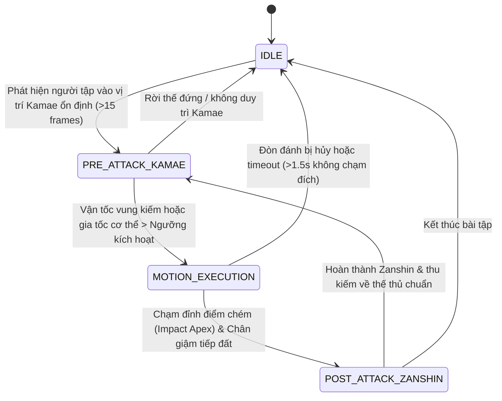

# Open-Kendo: System Architecture & Motion Lifecycle Specification 🥋⚡

> **Version**: 0.2.0  
> **Status**: Approved Architectural Template  
> **Target**: Real-time Pedagogical Kendo Analysis (Camera Stream 60 FPS)

---

## 1. Executive Summary & Design Philosophy

In traditional Kendo, a valid strike (*Yuko-datotsu*) is not merely an isolated impact; it is the culmination of a continuous physical and mental progression: **Pre-attack Kamae** $\rightarrow$ **Explosive Motion Execution** $\rightarrow$ **Post-attack Zanshin**. 

Unlike general combat sports analysis or competition-oriented tracking (where speed and hit registration dominate), Open-Kendo focuses on **pedagogical precision (Kihon-waza)**. The system is designed to evaluate whether the practitioner's form adheres to standard instructional biomechanics throughout the full lifecycle of each strike.

---

## 2. High-Level Pipeline Architecture

```text
┌────────────────────────────────────────────────────────┐
│                 CAMERA INPUT STREAM (60FPS)            │
└───────────────────────────┬────────────────────────────┘
                            │ (Raw BGR Frames + Monotonic Timestamps)
                            ▼
┌────────────────────────────────────────────────────────┐
│         POSE & SHINAI EXTRACTION (MediaPipe/YOLO)      │
└───────────────────────────┬────────────────────────────┘
                            │ (33 Body Keypoints + Shinai Tip/Base Vector)
                            ▼
┌────────────────────────────────────────────────────────┐
│           STATE & MOTION LIFECYCLE TRACKER             │
└───────────────────────────┬────────────────────────────┘
                            │ (Finite State Machine: Dispatches frame metrics)
┌───────────────────────────┼────────────────────────────┐
│                           │                            │
▼                           ▼                            ▼
[PHA 1: PRE-ATTACK KAMAE]   [PHA 2: MOTION EXECUTION]   [PHA 3: POST-ATTACK ZANSHIN]
  • Trục lưng thẳng           • Trục lưng không ngả       • Rút về Kamae chuẩn
  • Khoảng cách 2 chân        • Đầu không lắc nghiêng     • Mũi kiếm hướng mục tiêu
  • Góc 2 tay chuẩn           • Đo đạc Ki-Ken-Tai-Ichi    • Sẵn sàng đòn tiếp theo
│                           │                            │
└───────────────────────────┼────────────────────────────┘
                            │ (Sub-scores: S_kamae, S_exec, S_zanshin)
                            ▼
┌────────────────────────────────────────────────────────┐
│           INTEGRATED SCORE & CONTINUOUS FEEDBACK       │
│   Score = (Kamae Score) + (Kinematics & Timing Score)  │
│           + (Zanshin Score)                            │
└────────────────────────────────────────────────────────┘
```

---

## 3. Detailed Component Breakdown

### 3.1. Camera Input Stream Layer (`open_kendo.utils.video_io`)
- **Frame Rate Target**: 60 FPS (tối thiểu) hoặc 120 FPS.
  - *Lý do kỹ thuật*: Pha tiếp đất của chân phải trong bước giậm *Fumikomi* diễn ra trong khoảng $40 - 120\text{ ms}$. Tại 30 FPS, thời gian giữa 2 frame liên tiếp là $33.3\text{ ms}$, gây sai số lên tới $\pm 33\%$. Tại 60 FPS ($16.6\text{ ms/frame}$), độ phân giải thời gian đủ để phân định thứ tự chạm sàn và chém kiếm.
- **Input Channels**: Webcam trực tiếp hoặc video ghi hình sẵn (Tandoku Dosa / Kihon Waza).

### 3.2. Perception Layer (`open_kendo.perception`)
- **Pose Estimator (`BasePoseEstimator`)**:
  - `MediaPipePoseEstimator`: Phục vụ môi trường CPU / máy tính cá nhân tốc độ cao.
  - `YOLOPoseEstimator`: Phục vụ GPU khi cần độ chính xác cao khi người tập mặc võ phục (*Gi / Hakama*) rộng.
  - *Output*: 33 điểm mốc giải phẫu (Anatomical Landmarks) chuẩn hóa.
- **Shinai Tracker (`ShinaiTracker`)**:
  - Theo dõi vệt kiếm (*Kensen* - đầu kiếm, *Tsuka* - chuôi kiếm) kết hợp góc cổ tay (*Tenouchi*).

---

## 4. State & Motion Lifecycle Tracker (FSM Specification)

Bộ theo dõi vòng đời chuyển động (`StateLifecycleTracker`) đóng vai trò điều phối trung tâm (Orchestrator) thông qua máy trạng thái hữu hạn:



---

## 5. Specification của 3 Pha Chuyển Động

### Pha 1: Pre-attack Kamae (`open_kendo.evaluation.kamae`)
Mục tiêu: Đánh giá tư thế chuẩn bị trước khi phát lực. Người tập phải tĩnh tâm và giữ thế thủ hoàn hảo.
1. **Trục lưng thẳng (Vertical Spine Alignment)**:
   - Góc trục cột sống (đoạn nối giữa điểm giữa 2 hông và điểm giữa 2 vai) so với trục thẳng đứng trọng trường: $|\theta_{\text{spine}}| \le 3.5^\circ$.
2. **Khoảng cách 2 chân (Stance Width & Heel Alignment)**:
   - Khoảng cách gót trước - gót sau xấp xỉ bằng một bàn chân người tập.
   - Gót chân trái hơi kiễng nhẹ khỏi mặt sàn (không bẹp gót, không nhấc quá cao).
   - Hai bàn chân song song hướng thẳng về phía trước.
3. **Góc 2 tay & Vị trí kiếm (Chudan-no-kamae)**:
   - Cổ tay trái nằm trên đường trung tâm, cách rốn khoảng một nắm tay.
   - Góc gập khuỷu tay phải tạo độ thoải mái mở rộng ($\approx 135^\circ - 155^\circ$).
   - Mũi kiếm Kensen hướng vào yết hầu đối phương.

---

### Pha 2: Motion Execution (`open_kendo.evaluation.kikentaichi` & `kinematics`)
Mục tiêu: Phân tích kỹ thuật phát lực, chuyển động cơ thể trong quá trình chém và độ đồng bộ Ki-Ken-Tai-Ichi.
1. **Trục lưng không ngửa/gập (Dynamic Spine Stability)**:
   - Khi vung kiếm lên (*Furikaburi*) và chém xuống (*Furioroshi*), trục lưng không được ngả về sau để lấy đà hoặc chúi người về trước quá mức ($|\Delta \theta_{\text{spine}}| \le 5^\circ$).
2. **Đầu không lắc nghiêng (Head Level & Eye Line Stability)**:
   - Trục ngang nối 2 mắt/tai phải giữ cân bằng song song mặt đất, tránh nghiêng đầu khi chém.
3. **Đo đạc Ki-Ken-Tai-Ichi ($\Delta t_{\text{sync}}$)**:
   - Xác định thời điểm $t_{\text{Ken}}$: Thời điểm đỉnh vận tốc hạ kiếm hoặc va chạm mục tiêu.
   - Xác định thời điểm $t_{\text{Tai}}$: Thời điểm chân phải giậm chạm sàn (*Fumikomi impact*).
   - Tính toán chênh lệch: $\Delta t = |t_{\text{Ken}} - t_{\text{Tai}}|$.
     - $\Delta t \le 40\text{ ms}$: **Hoàn hảo (Ichi tuyệt đối - 100đ)**.
     - $40\text{ ms} < \Delta t \le 80\text{ ms}$: **Tốt (85đ)**.
     - $80\text{ ms} < \Delta t \le 130\text{ ms}$: **Chấp nhận được (65đ)**.
     - $\Delta t > 130\text{ ms}$: **Lệch pha (Desynchronized)**.

---

### Pha 3: Post-attack Zanshin (`open_kendo.evaluation.zanshin`)
Mục tiêu: Đánh giá sự tỉnh thức và kiểm soát sau khi chém. Trong Kendo: *"Đòn đánh chỉ kết thúc khi Zanshin hoàn tất"*.
1. **Rút về Kamae chuẩn (Smooth Recovery)**:
   - Sau khi chém, người tập không buông lỏng tay hoặc hạ kiếm mất kiểm soát, mà thu kiếm về thế thủ sẵn sàng trong khoảng $0.3 - 0.8\text{ giây}$.
2. **Mũi kiếm hướng mục tiêu (Centerline Dominance)**:
   - Mũi kiếm *Kensen* lập tức kiểm soát đường trung tâm, hướng thẳng vào cổ họng hoặc mắt đối thủ.
3. **Sẵn sàng đòn tiếp theo (Readiness & Mental Alertness)**:
   - Giữ nguyên tư thế thăng bằng, trọng tâm vững vàng, không chới với về phía trước.

---

## 6. Integrated Scoring Formula

Điểm số tích hợp ($S_{\text{total}} \in [0, 100]$) được tính bằng tổng có trọng số của 3 pha:

$$S_{\text{total}} = w_{\text{kamae}} \cdot S_{\text{kamae}} + w_{\text{exec}} \cdot S_{\text{exec}} + w_{\text{zanshin}} \cdot S_{\text{zanshin}}$$

Trong đó:
- $w_{\text{kamae}} = 0.25$ (25%): Điểm thế thủ chuẩn bị.
- $w_{\text{exec}} = 0.50$ (50%): Điểm kỹ thuật động học & Ki-Ken-Tai-Ichi:
  $$S_{\text{exec}} = 0.50 \cdot S_{\text{sync}} + 0.30 \cdot S_{\text{spine\_stability}} + 0.20 \cdot S_{\text{head\_level}}$$
- $w_{\text{zanshin}} = 0.25$ (25%): Điểm Zanshin kiểm soát sau đòn đánh.

---

## 7. Data Contracts & Module Interfaces

```text
open_kendo/
├── perception/             # Trích xuất hình ảnh (MediaPipe / YOLO)
├── features/               # Động học góc khớp, vận tốc, trọng tâm
├── evaluation/
│   ├── lifecycle.py        # StateLifecycleTracker & FSM Engine
│   ├── kamae.py            # KamaeEvaluator (Pha 1)
│   ├── kikentaichi.py      # KiKenTaiIchiEvaluator (Pha 2)
│   ├── zanshin.py          # ZanshinEvaluator (Pha 3)
│   └── scorer.py           # KendoScorer (Integrated Scoring)
├── ui/                     # Visual Overlay & HUD Dashboard
└── utils/                  # Video I/O, Config, Logging
```

Tất cả các module Python chỉ đóng vai trò template khung (Class shells, Typed signatures, Docstrings) sẵn sàng cho việc triển khai thuật toán chi tiết khi có dữ liệu chuẩn.
